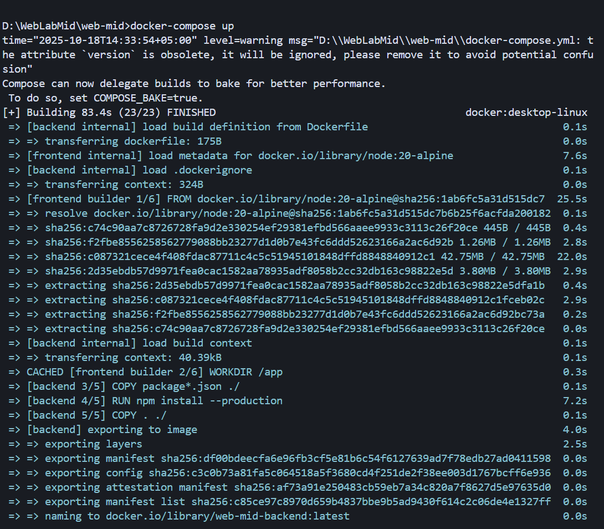

# WebLab Mid Project

A full-stack web application for managing visitors and residents, built with React frontend, Node.js backend, and MongoDB database, all containerized with Docker.

## Project Overview

This project consists of:

- **Frontend**: React application with Vite build tool and Tailwind CSS
- **Backend**: Node.js Express API server with MongoDB integration
- **Database**: MongoDB for data persistence
- **Reverse Proxy**: Nginx for serving the frontend and routing API requests

## Project Structure

```
web-mid/
├── frontend/          # React frontend application
├── backend/           # Node.js backend API
├── docker-compose.yml # Docker orchestration
├── nginx.conf        # Nginx configuration
└── README.md         # This file
```

## Frontend

### Technology Stack

- **React 19** - Frontend framework
- **Vite** - Build tool and development server
- **Tailwind CSS** - Utility-first CSS framework
- **React Router DOM** - Client-side routing

### Features

- Visitor management system
- Resident management system
- Device management
- Responsive design with modern UI

### Frontend Dockerfile

```dockerfile
# Build stage
FROM node:20-alpine AS builder
WORKDIR /app
COPY package*.json ./
RUN npm install
COPY . .
RUN npm run build

# Production stage
FROM nginx:alpine
COPY --from=builder /app/dist /usr/share/nginx/html
# Nginx config will be mounted via docker-compose
```

**Explanation:**

- **Multi-stage build**: Uses Node.js Alpine for building, then Nginx Alpine for serving
- **Build stage**: Installs dependencies, copies source code, and builds the production bundle
- **Production stage**: Copies the built files to Nginx's HTML directory
- **Optimized**: Smaller final image size by excluding build dependencies

## Backend

### Technology Stack

- **Node.js 20** - Runtime environment
- **Express.js** - Web framework
- **MongoDB** - Database
- **Mongoose** - MongoDB object modeling
- **CORS** - Cross-origin resource sharing

### Features

- RESTful API endpoints
- MongoDB integration
- Visitor and resident data management
- CORS enabled for frontend communication

### Backend Dockerfile

```dockerfile
FROM node:20-alpine
WORKDIR /app
COPY package*.json ./
RUN npm install --production
COPY . ./
EXPOSE 5000
CMD ["node", "index.js"]
```

**Explanation:**

- **Base image**: Node.js 20 Alpine (lightweight Linux distribution)
- **Working directory**: Sets `/app` as the working directory
- **Dependencies**: Installs only production dependencies
- **Port**: Exposes port 5000 for the API server
- **Command**: Starts the application with `node index.js`

## Docker Compose Configuration

```yaml
services:
  frontend:
    build:
      context: ./frontend
    ports:
      - "80:80"
    volumes:
      - ./nginx.conf:/etc/nginx/conf.d/default.conf
    depends_on:
      - backend

  backend:
    build:
      context: ./backend
    ports:
      - "5000:5000"
    environment:
      - MONGO_URI=mongodb://mongodb:27017/secure-nest
    depends_on:
      - mongodb

  mongodb:
    image: mongo:latest
    volumes:
      - mongodb_data:/data/db

volumes:
  mongodb_data:
```

**Service Configuration:**

- **Frontend**: Nginx server on port 80 with custom configuration
- **Backend**: Express API on port 5000 with MongoDB connection
- **MongoDB**: Database with persistent volume storage
- **Dependencies**: Proper service startup order

## Nginx Configuration

```nginx
server {
    listen 80;
    server_name localhost;

    location / {
        root /usr/share/nginx/html;
        index index.html;
        try_files $uri $uri/ /index.html;
    }

    # Proxy API requests to the server container
    location /api/ {
        proxy_pass http://backend:5000/api/;
        proxy_http_version 1.1;
        proxy_set_header Upgrade $http_upgrade;
        proxy_set_header Connection 'upgrade';
        proxy_set_header Host $host;
        proxy_cache_bypass $http_upgrade;
    }
}
```

**Features:**

- **Static file serving**: Serves the React build files
- **SPA routing**: Handles client-side routing with `try_files`
- **API proxying**: Routes `/api/` requests to the backend service
- **WebSocket support**: Handles upgrade headers for real-time features

## Prerequisites

- Docker Desktop installed and running
- Git (for cloning the repository)

## Steps to Run the Project

### 1. Clone the Repository

```bash
git clone <repository-url>
cd web-mid
```

### 2. Start Docker Desktop

Make sure Docker Desktop is running on your system.

### 3. Build and Start Services

```bash
# Start all services in detached mode
docker-compose up -d

# Or start with build (if you made changes to Dockerfiles)
docker-compose up --build -d
```

**Screenshot of successful Docker Compose build:**


_Note: The screenshot shows the successful build process with all services (frontend, backend, mongodb) being built and started successfully. The build completed in 83.4 seconds, indicating that Docker Desktop is running properly and all dependencies are correctly configured._

### 4. Access the Application

- **Frontend**: http://localhost (port 80)
- **Backend API**: http://localhost:5000
- **MongoDB**: Available internally to backend service

### 5. View Logs (Optional)

```bash
# View all logs
docker-compose logs

# View specific service logs
docker-compose logs frontend
docker-compose logs backend
docker-compose logs mongodb
```

### 6. Stop Services

```bash
# Stop all services
docker-compose down

# Stop and remove volumes (clears database data)
docker-compose down -v
```

## Development Commands

### Frontend Development

```bash
cd frontend
npm install
npm run dev          # Start development server
npm run build        # Build for production
npm run preview      # Preview production build
npm run lint         # Run ESLint
```

### Backend Development

```bash
cd backend
npm install
npm start            # Start the server
```

## Troubleshooting

### Common Issues

1. **Docker Desktop not running**

   - Error: `open //./pipe/dockerDesktopLinuxEngine: The system cannot find the file specified`
   - Solution: Start Docker Desktop application

2. **Port already in use**

   - Error: `bind: address already in use`
   - Solution: Stop other services using ports 80 or 5000, or change ports in docker-compose.yml

3. **Build failures**

   - Check Dockerfile syntax
   - Ensure all required files exist
   - Run `docker-compose up --build` to rebuild images

4. **Database connection issues**
   - Ensure MongoDB service is running
   - Check environment variables in docker-compose.yml

### Useful Commands

```bash
# Check running containers
docker ps

# View container logs
docker logs <container-name>

# Access container shell
docker exec -it <container-name> sh

# Remove all containers and images
docker-compose down --rmi all

# Clean up unused resources
docker system prune
```

## Project Features

- **Visitor Management**: Add, view, and manage visitor records
- **Resident Management**: Manage resident information
- **Device Management**: Track and manage devices
- **Responsive Design**: Works on desktop and mobile devices
- **Modern UI**: Clean interface with Tailwind CSS
- **API Integration**: RESTful API with MongoDB backend
- **Containerized**: Easy deployment with Docker

## API Endpoints

The backend provides RESTful API endpoints for:

- Visitor management
- Resident management
- Device management
- Data persistence with MongoDB

## Contributing

1. Fork the repository
2. Create a feature branch
3. Make your changes
4. Test with Docker Compose
5. Submit a pull request

## License
